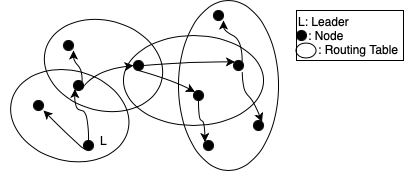

#### Authors
- Michael Hodges
- Matthew Kuhn
- Nadiia Ramthun
- Alexander Stults
# Summary Description

In this paper we propose a distributed system for a fleet of semi-autonomous robots exploring a planet. In our hypothetical scenario a group of robots are placed onto a planet and begin exploring the surface. The robots goal is to maintain and agree upon their state, maintain communication, and distribute tasks. In so doing, the robots must be able to keep track of their own state as well as access information about other robots states, coordinate tasks broadcasted to them, agree upon data, and communicate reliably with one another.

### Key features of our distributed system:

- No centralized servers
- Nodes can enter and leave certain reachable parts of the network.
- Managing a global state
- Coordinating tasks
- Reliable communication to the group

### Expected scenarios to handle
We also list out some failure scenarios that we hope to be able to tackle in our implementation

- Unreachable robot. How can we handle a robot going offline for an extended period and reentering the network.
- Dropped messages. We need to ensure that our nodes reliably deliver messages to the leader and other members of the fleet.

In general, we can abstract our problem out to a higher level and describe it as a peer-to-peer network used to maintain the state of a distributed system. Within this description the commands we send will merely be updated in the state of a specific robot.

### Features out of scope
To eliminate scope creep we will only implement a subset of algorithms and focus only on the distributed system aspect of our application. Therefore the following will not be included in our implementation:

- Robot Navigation: Developing an algorithm for how to control the robots would be necessary in a real application but does not aid in the learning and development of distributed systems.
- Robotic mesh network: we will assume that this network exists and allows our robots to talk to each other.
- Altitude and coordinate calculation: obviously on a planet there are no existing satellites and therefore, no way to utilize such satellites to calculate coordinates. Thus, we will generate our data in a relative way and not focus on what the data actually is.
- Issuing commands: To control the fleet of robots some centralized command will be issued from the likes of a NASA. This is out of our scope and will assume we can broadcast commands and we will focus on developing a way to handle simulated commands

# Archichitecture overview diagram and design description

In this diagram we propose an architecture to implement our semi-autonomous exploratory robots. As can be seen in the image we have a set of nodes, which represent the robots on the planet. These nodes have a set of other nodes they communicate with which are represented by the dark dots. A specified leader is represented by the letter "L" in the figure. This leader is shown to be multicasting a message. However, the leader is unable to communicate with nodes outside of it's routing table. Therefore, a peer-to-peer network will be utilized to forward the messages within each nodes routing network. In this way, the leader will be able to route messages to nodes outside of it's reachable range and the commands will be able to be completed.

# Implementation Approach
We have looked at a variety of packages for our implementation, but due to the unique scenario that we propose we will need to implement all of th algorithms on our own. Especially for peer-to-peer, in which the algorithms proposed are used for static purposes we will need to update our GUID's (see below) for moving robots. Furthermore, the algorithms described below have straightforward approaches that can be implemented. In so doing, the algorithms for the following will be implemented for our application by ourselves: Leader election, Concensus, Peer-to-Peer, and reliable multicast. 

# Key Algorithms
In this section we review the algorithms we will implement for our semi-autonomous robotic system. In so doing we will review the following algoritms: Leader election, Concensus, group membership, and multicast/reliable multicast.

### Leader election (Bully Algorithm)
Within the fleet of robots a leader will need to be elected. The leader will be responsible for assigning tasks within the fleet and ensuring their completion.

In order to elect a leader we will use the Bully algorithm. This algorithm can handle crashes within the election process, and unlike the ring-algorithm, doesn't require the candidates to know their direct neighbors. The Bully algorithm requires a unique id for each member that can ordered by each member and for this I suggest either a MAC address or some sort of hardware level unique identifier. This will allow us to avoid the Bully algorithm's failure case around two candidates with identical priority numbers.

### Concensus
Another algorithm that we plan to use in our solution is the one that handles coordinate task consensus. Since robots will receive the messages from the port on Earth as to where to go to explore items such as rocks, there might be delay, wrong ordering of messages, or even tampering with messages received by malicious party. Furthermore, the robot may lose part of its state if it crashes. Upon receival of messages, the robots must conclude as to how to proceed with their task. 
 
In general, the agreement algorithms work by each process starting in undecided state and proposing a value from a set of possible values for the solution. After that, each process decided upon the value in question and enters a decided state in which they no longer can change their decision. Each algorithm solving consensus problem must have following properties. First, in order to be useful at all, an algorithm must terminate with each process setting its value. Second, all correct processes must agree and choose the same value upon entering a decided state. Third, the algorithm must have an “integrity” that is if a correct process proposed a value upon entering a decided state, it must choose that value.

In asynchronous distributed system reaching consensus cannot be guaranteed. Therefore, our solution must be a synchronous system, in which we can use simple multicast to broadcast all values we consider to be correct by each process and assume the number of the failure out of all processes we expect to occur. After completing one more round than assumed number, we can pick the minimum value.

### Peer-to-Peer Network
  To implement a peer to peer system the main focus will be on the routing algorithm. We will follow the algorithm as implemented by Pastry, a message routing infrastructure. In so doing, each node of our algorithm will be given a GUID (globally unique identifier). The goal of pastry is to continually transport a message to a node that is closer to the destination node. Utilizing the GUID the message is transported to a node who's GUID is closer to the destination ID. The underlying transport protocol for these messages is normally UDP. To avoid excessive amounts of hops a routing table is developed to reduce the hop-count or round trip latency. With the use of a routing table and appropriate routing algorithm the message can be delivered in O(log N) steps.

We will now get into more details on how the algorithm is implemented. Each node maintains a tree-structured routing table of GUIDs and IP addresses. This routing table has as many rows as there are hexadecimal digits in the GUID, therefore, if there are 128 bits in a GUID the routing table will have 128/4 = 32 rows. Now that we have a routing table we look to handle messages passed from one node to another. Given a message M and a node D to which the message will be delivered we look to deliver the message. To make this happen we look and see if the message is within the leaf set l where l is equal to the count of the number of GUID's to hold. If it is within the range then the message is sent. If not the routing table is used to send the message M to a node with a closer GUID. This algorithm repeats unless it reaches a terminating condition of no entry in the routing table. This termination condition comes if there is no shorter GUID prefix to find and therefore there is no entry in the routing table to link this too. 

To add a new node, the new node computes a suitable GUID using a specified hash function and then make scontact with another nearby node to add it to the existing routing table. Furthermore, upon failure, which is defined as when another node cannot communicate with it, the routing table is repaired by looking for live nodes and filling in the routing table.

### Multicast
We will need to use FIFO ordering with multicast, in order to ensure that all messages and commands from the leader to the rest of the robots are received in the proper execution order. Within this system, order of message receipt by the robots is crucial, as executing commands out of order could have disastorous consequences, including the loss of a robot. Our multicast system will maintain reliability by ensuring integrity, validity, and agreement. To ensure the system's integrity, we will ensure that a process only delivers each message at most one time. For validity, we must ensure that if process multicasts a message, then that message will eventually be delivered. Finally, to guarantee agreement, we will ensure that if one process delivers a message, then all other members of the group will also eventually deliver that message.

This reliable multicast can be accomplished by building on top of basic multicast. When a process sends a message, it basic-multicasts it to the group, including itself. Whenever a message is delivered to a process using basic-deliver, the process checks to make sure the message is not a duplicate, and if not, it basic-multicasts the message again to the group, including itself. Once this has been done, it finally delivers the message. This methodology ensures that every process in the group will receive a message, and by checking if it has already been received, we can ensure there are no duplicate messages.

# Expected results

In conclusion, we hope to develop and demonstrate a successful simulation of a fleet of 
robots exploring the surface of an unknown planet. 
With this simulation we will show how our four chosen algorithms 
(leader election, concensus, peer-to-peer, and reliable multicast) are able to maintain 
the state of a distributed system, agree upon data, and distribute tasks over a constantly
 changing network. Our results will be shown via the terminal where we can run multiple
  simulated robots, pass commands, and view the states of said robots.
